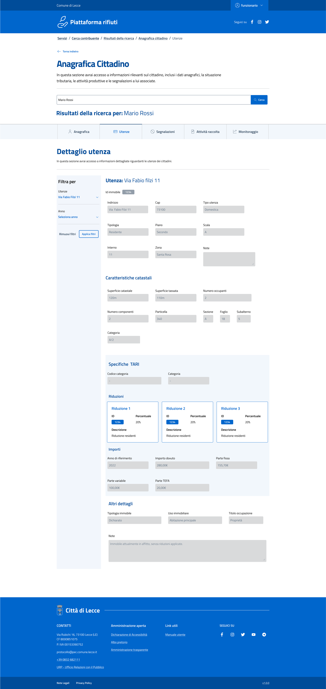

## Project

- **Name:** Raccolta Puntuale
- **Customer:** Commune di Lecce

## Technologies Used

- **Backend:** C# ASP.NET MVC  
- **Frontend:** Bootstrap Italia (UI framework)  
- **Database:** Microsoft SQL Server 2019 (MSSQL 19)  
- **Version Control / CI/CD:** Azure DevOps (Microsoft DevOps)

## Team

- Developed by a **4-person team**: 3 developers and 1 designer.
- **Development Duration:** 9 months  

## Screenshots

### Desktop version

### Mobile version

